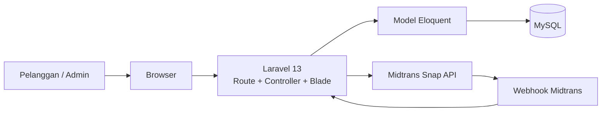
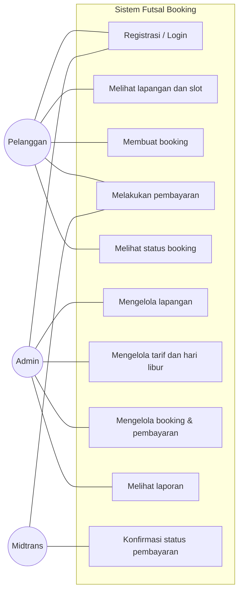
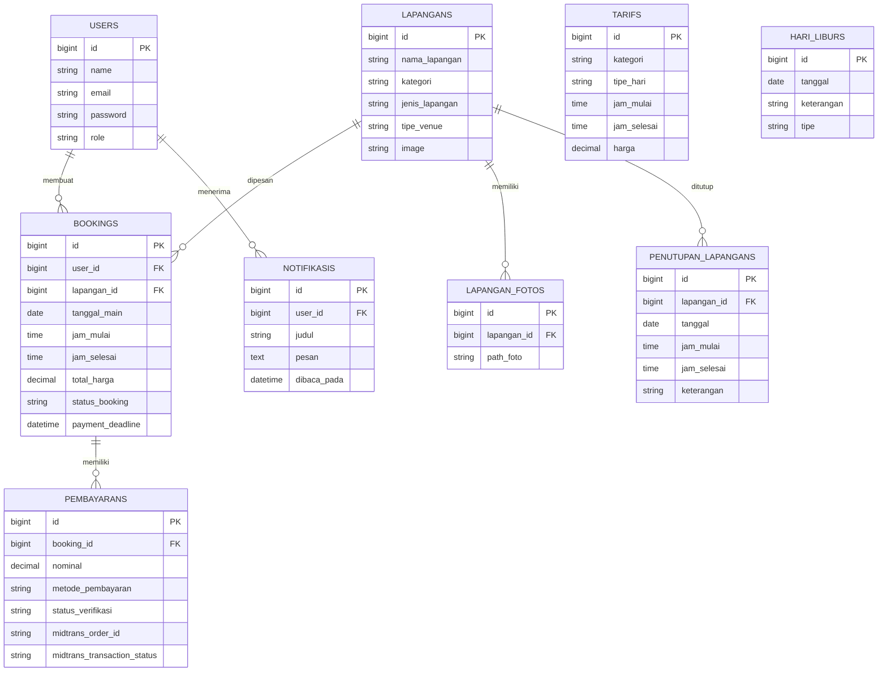
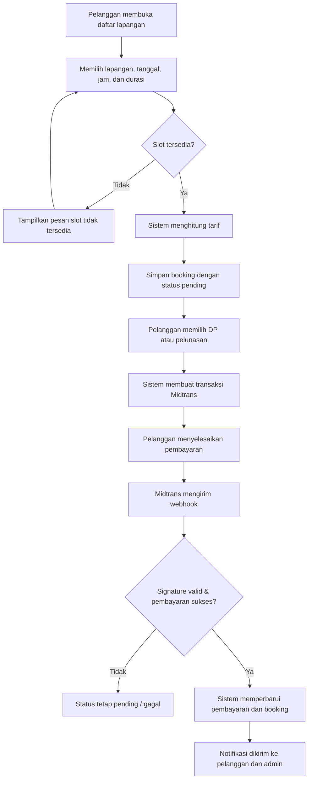
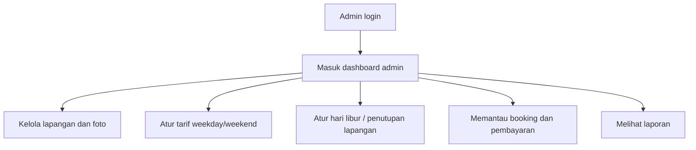

# Presentasi Proyek — Sistem Booking Lapangan Futsal

**Nama proyek:** Futsal Booking

**Jenis aplikasi:** Aplikasi web untuk pemesanan lapangan futsal secara online

**Teknologi utama:** Laravel 13, PHP, MySQL, Blade, Tailwind CSS, Alpine.js, Vite, dan Midtrans

---

## 1. Penjelasan Project

Futsal Booking adalah aplikasi web yang mempermudah pelanggan dalam melihat lapangan, mengecek jadwal kosong, melakukan pemesanan, dan membayar booking secara online. Aplikasi juga menyediakan panel admin agar pengelola dapat mengatur lapangan, tarif, jadwal penutupan, booking, pembayaran, hari libur, serta laporan.

### Latar belakang masalah

Pemesanan lapangan secara manual sering menimbulkan beberapa masalah:

- Pelanggan harus bertanya langsung untuk mengetahui jadwal kosong.
- Risiko jadwal booking bertabrakan cukup besar.
- Admin kesulitan memantau pembayaran dan riwayat booking.
- Perhitungan tarif weekday dan weekend dapat dilakukan secara tidak konsisten.

### Solusi yang diberikan

Sistem ini menyediakan:

- Informasi lapangan dan ketersediaan jadwal secara online.
- Validasi untuk mencegah dua pelanggan memesan slot waktu yang sama.
- Perhitungan tarif otomatis berdasarkan kategori lapangan, jam, dan jenis hari.
- Pembayaran DP atau pelunasan melalui Midtrans, serta opsi bayar cash langsung di lokasi.
- Dashboard admin untuk pengelolaan operasional.
- Notifikasi dan pengingat jadwal bermain.

### Arsitektur singkat

---

## 2. Use Case Diagram

### Aktor

1. **Pelanggan/Penyewa** — pengguna yang mencari dan memesan lapangan.
2. **Admin** — pengelola operasional lapangan dan booking.
3. **Midtrans** — pihak ketiga yang memproses pembayaran online dan mengirim status pembayaran.

### Ringkasan use case

| Aktor | Aktivitas utama |
|---|---|
| Pelanggan | Registrasi/login, melihat lapangan, mengecek slot, membuat booking, membayar, melihat status booking |
| Admin | Mengelola lapangan, foto, tarif, hari libur, penutupan lapangan, booking, pembayaran, dan laporan |
| Midtrans | Membuat transaksi pembayaran dan mengirim notifikasi status pembayaran ke webhook |

---

## 3. Gambar / Diagram Database (ERD)

Database yang digunakan adalah **MySQL**. Laravel menggunakan **Eloquent ORM** dan migration untuk membuat serta mengelola tabel.

### Penjelasan relasi utama

- Satu **user** dapat membuat banyak **booking**.
- Satu **lapangan** dapat memiliki banyak booking dan banyak foto.
- Satu **booking** dapat memiliki satu atau lebih catatan **pembayaran**.
- **Tarif** digunakan untuk menentukan harga berdasarkan kategori lapangan, jenis hari, dan rentang jam.
- **Hari libur** dan **penutupan lapangan** digunakan untuk membatasi ketersediaan slot.

---

## 4. Diagram Proses Bisnis

### Proses booking dan pembayaran

### Proses admin

---

## 5. Demo Project

Gunakan urutan demo berikut agar presentasi jelas dan tidak terlalu panjang.

### A. Halaman publik (± 1 menit)

1. Buka halaman beranda.
2. Jelaskan bahwa pengunjung dapat melihat informasi lapangan dan tarif.
3. Buka menu **Lapangan**.
4. Pilih satu lapangan, lalu tampilkan detail serta slot jadwalnya.

**Kalimat presentasi:**
> Pada bagian ini, pelanggan dapat mencari lapangan dan melihat ketersediaan jadwal sebelum melakukan pemesanan.

### B. Booking sebagai pelanggan (± 2 menit)

1. Login sebagai pelanggan atau registrasi akun baru.
2. Pilih lapangan, tanggal, jam mulai, dan durasi.
3. Tunjukkan bahwa sistem menghitung total harga secara otomatis.
4. Simpan booking.
5. Coba pilih slot yang sama untuk menunjukkan validasi bentrok jadwal, bila data demo tersedia.
6. Buka detail booking dan status pembayarannya.

**Kalimat presentasi:**
> Sistem memvalidasi slot agar tidak ada dua pelanggan yang memesan lapangan dan jam yang sama. Tarif juga dihitung berdasarkan aturan yang telah diatur admin.

### C. Pembayaran Midtrans (± 1 menit)

1. Dari form booking, tunjukkan dua metode: **Bayar Online** dan **Bayar di Tempat (Cash)**.
2. Untuk pembayaran online, pilih nominal DP atau pelunasan lalu tampilkan halaman/pop-up Midtrans Snap.
3. Untuk pembayaran cash, jelaskan pelanggan membayar saat datang dan admin menekan tombol **Konfirmasi Pembayaran Cash** dari detail booking.
4. Jelaskan bahwa status pembayaran Midtrans diproses melalui webhook, bukan hanya dari browser pelanggan.

**Kalimat presentasi:**
> Midtrans mengirim notifikasi ke server Laravel. Server memverifikasi signature notifikasi sebelum mengubah status booking dan pembayaran, sehingga lebih aman. Untuk pembayaran cash, admin mengonfirmasi pembayaran setelah pelanggan membayar langsung di lokasi.

> Jika koneksi Midtrans sandbox tidak siap saat presentasi, cukup tampilkan halaman pembayaran dan jelaskan alurnya. Jangan memaksakan transaksi nyata.

### D. Dashboard admin (± 2 menit)

1. Logout, lalu login sebagai admin.
2. Tampilkan dashboard admin.
3. Buka halaman **Lapangan** untuk menambah atau mengubah data lapangan.
4. Buka halaman **Tarif** untuk memperlihatkan harga weekday dan weekend.
5. Buka **Hari Libur/Ketersediaan** untuk menunjukkan cara menutup slot lapangan.
6. Buka **Booking**, **Pembayaran**, dan **Laporan**.

**Kalimat presentasi:**
> Admin memiliki panel khusus untuk mengelola seluruh data operasional. Pemisahan peran ini membatasi akses pelanggan agar tidak dapat mengubah data administratif.

---

## 6. Poin Penutup

- Sistem mengubah proses booking dari manual menjadi digital dan terstruktur.
- Pelanggan dapat melihat jadwal, memesan, dan membayar secara online.
- Admin dapat mengelola seluruh operasional dari satu dashboard.
- Validasi ketersediaan membantu mencegah jadwal booking bertabrakan.
- Integrasi Midtrans mendukung alur pembayaran yang lebih aman dan terdokumentasi.

## 7. Persiapan Sebelum Presentasi

- Pastikan MySQL aktif dan database `futsal_db` dapat diakses.
- Jalankan aplikasi dengan `php artisan serve`.
- Jalankan Vite dengan `npm run dev` bila menggunakan mode pengembangan.
- Siapkan akun pelanggan dan admin untuk demo.
- Siapkan satu contoh booking dan pembayaran agar halaman admin tidak kosong.
- Siapkan koneksi internet jika mendemokan Midtrans Sandbox.
- Jika Midtrans tidak dapat diakses, fokus pada alur booking dan dashboard admin.
